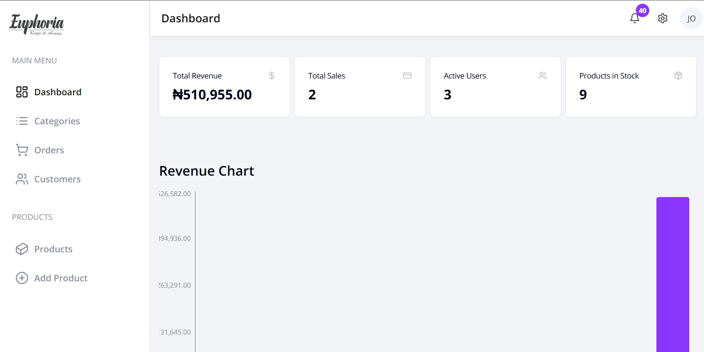
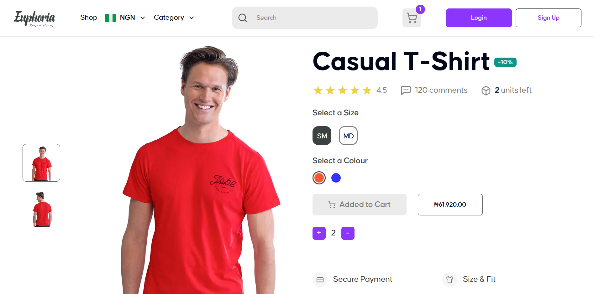
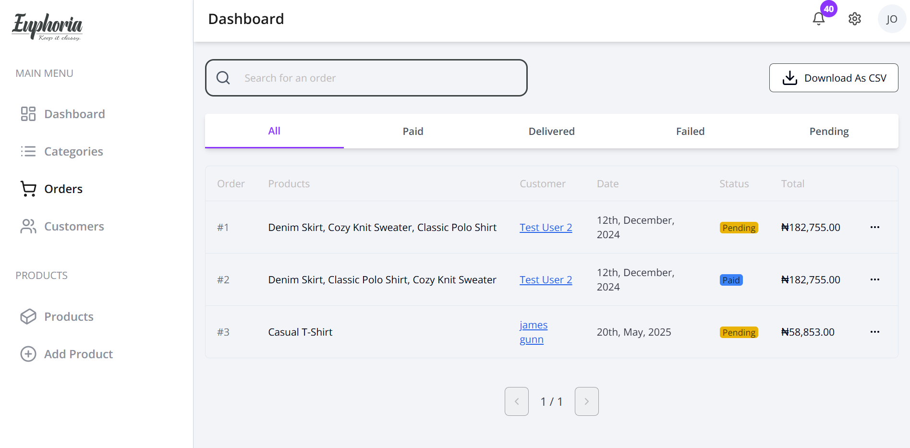
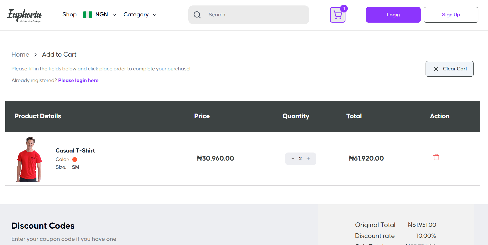
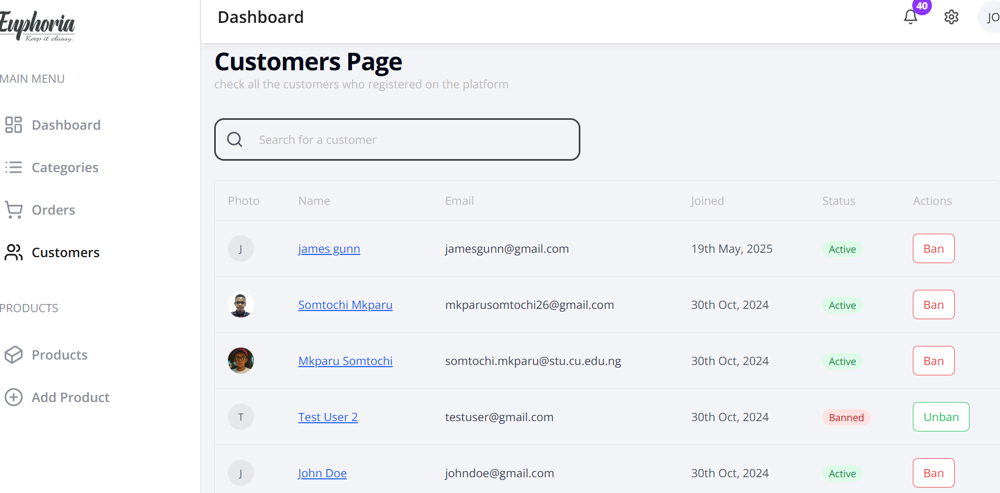
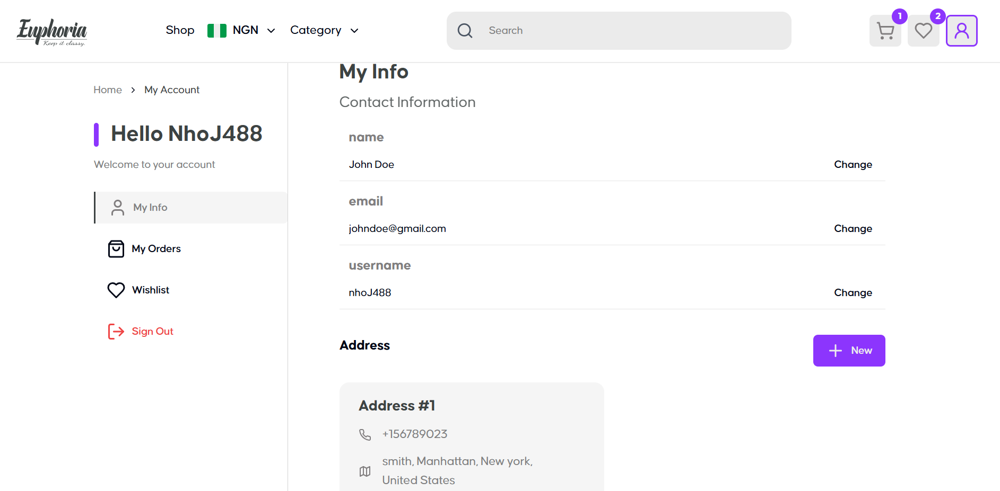
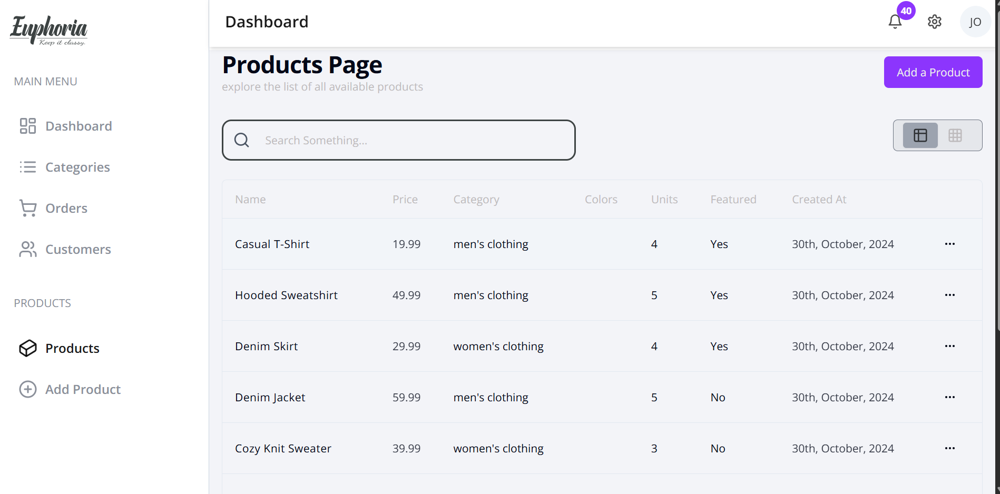
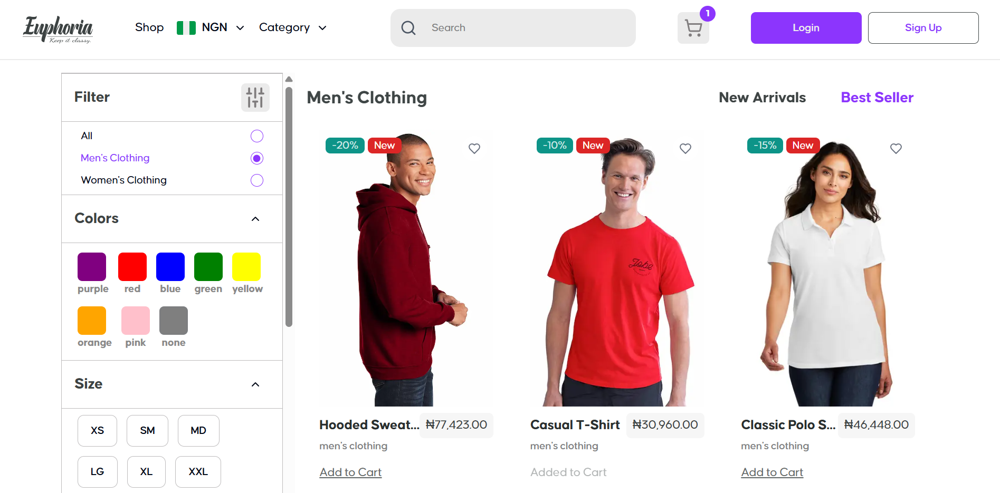
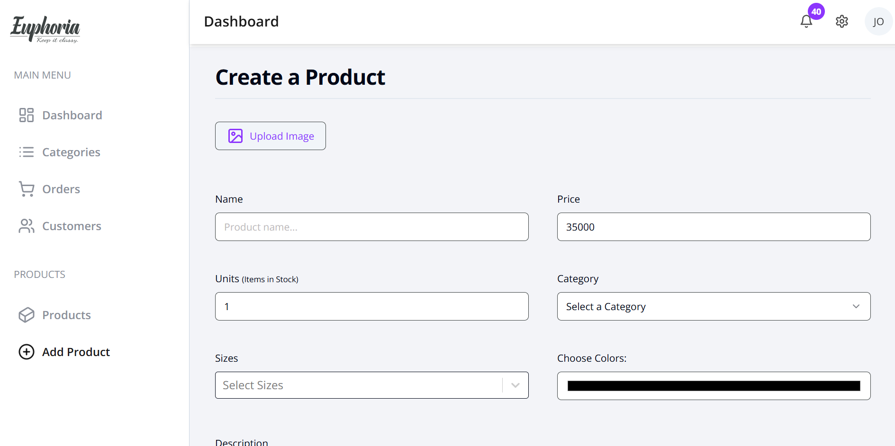
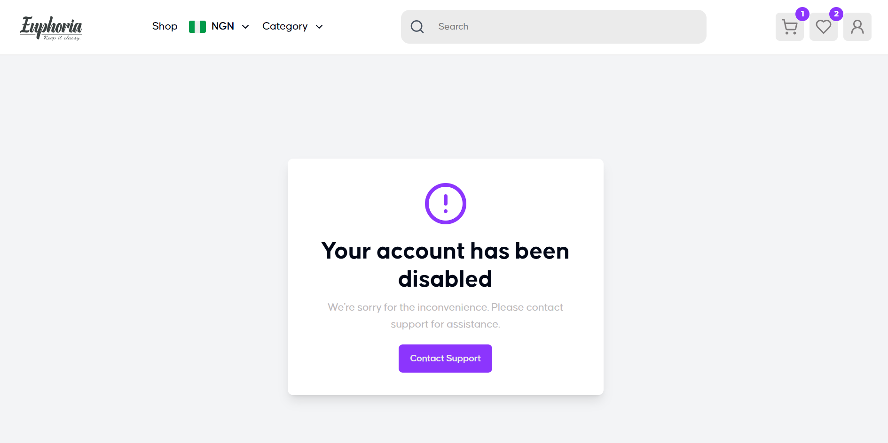

<div align="center">
  
   <h1>Euphoria</h1>
</div>


Euphoria is a full-stack e-commerce application built with Next.js, TypeScript, and TailwindCSS. It features a custom admin panel, customer dashboard, and a bespoke Stripe-powered payment form. The project is designed to be modular and easy to extend, making it a great starting point for your own e-commerce applications.
## 📦 Features
1. **Customer Dashboard**: Users can manage their profiles, view order history, and manage their addresses.
2. **Admin Dashboard**: Admins can manage products, orders, and users. view transactions through interactive charts.
3. **Wishlist**: Users can save products for later.
4. **Cart**: Users can add products to their cart and proceed to checkout.
5. **Checkout**: A custom Stripe payment form for secure transactions.
6. **Authentication**: Euphoria comes with built-in authentication using NextAuth.js, supporting GitHub and Google sign-in.
7. **Responsive Design**: The application is fully responsive, ensuring a great user experience on all devices.
8. **Design System**: the project is built with a custom design system, which can be accessed on the `/style-guide` page.
9. **Localized Currency Conversion**: The application supports multiple currencies, with a simple conversion logic that can be extended to use real-time APIs.
10. **Error Tracking**: Integrated with Sentry for error tracking and monitoring.


[](#)
[](#)
[](#)
[](#)
[](#)
[](#)
[](#)
[](#)
[](#)
[](#)
[](#)
[](#)
[](#)
[](#)
[](#)

---

## ✨ Figma Design

You can view the full Figma file for this project here:  
👉 [Euphoria Figma UI](https://www.figma.com/design/ROjzTzngj2JX1NtXnzMCEC/Euphoria---Ecommerce--Apparels--Website-Template--Community-?node-id=0-1&p=f&t=jJ7jXomKTTvfcxSg-0)

---


## 🖼️ Screenshots

| Customer View                                         | Admin Dashboard                                       |
| ----------------------------------------------------- | ----------------------------------------------------- |
|      |  |
|  |       |
|           |         |
|  |       |
|          |  |
|          | |
---
## 📁 Folder Structure

The project follows a **colocation-first structure**:

```

src/
├── app/                    # Pages and API routes (App Router)
│   ├── (main)/             # Public-facing pages
│   └── (admin)/            # Admin dashboard pages
│
├── components/             # Shared/reusable components
├── lib/                    # Utility functions, config, constants
├── hooks/                  # Custom React hooks
├── actions/                # Server actions
├── schema/                 # Zod schema definitions
├── flags/                  # Feature toggles and constants
└── types/                  # TypeScript types

```

Each page folder **contains its own UI components** for colocation, making it easier to manage and understand

---

## 🔐 Extended Prisma Adapter for NextAuth

This project uses **NextAuth** for authentication, but with a slight modification — the [Prisma Adapter](https://authjs.dev/reference/adapter/prisma) was **extended to support role-based authorization** (e.g., `ADMIN`, `CUSTOMER`).  

You can check the modified adapter inside the `lib/next-auth/adapter.ts` file.

the extended types for session and the adapter are located in the root level of the project within the `next-auth.d.ts` folder

---

## 🌍 Currency Conversion Logic

Currency values are **hardcoded for now**, using static exchange rates defined in the `lib/constants.ts` file.  
If you'd like to integrate a real-time currency conversion service (like fixer.io or OpenExchangeRates), modify the logic inside:

```
/utils/convertToCurrency.ts
```


## 📜 Environment Variables (`.env`)

Below are the required env variables for this project:

```bash
# App
# DATABASE 
DATABASE_URL=
#CLOUDINARY
NEXT_PUBLIC_CLOUDINARY_CLOUD_NAME=
#AUTHENTICATION
GITHUB_CLIENT_ID=
GITHUB_CLIENT_SECRET=
GOOGLE_CLIENT_ID=
GOOGLE_CLIENT_SECRET=
# (Optional)
RESEND_API_KEY=
# PAYMENT
STRIPE_SECRET_KEY=
STRIPE_WEBHOOK_SECRET=
NEXT_PUBLIC_STRIPE_PUBLISHABLE_KEY=
# CURRENCY CONVERSION
IP_GEOLOCATION_API_KEY=
```


## 🚀 Getting Started

1. **Clone the repo:**

```bash
   git clone https://github.com/your-user/euphoria.git
   cd euphoria
```

2. **Install dependencies:**

   ```bash
   pnpm install
   ```

3. **Configure environment variables:**

   Create a `.env` file using the template above.

4. **Seed the database:**

   Inside the `prisma/` directory, there is a `seed.ts` file.
   Get your MongoDB URI and run:

   ```bash
   npx prisma db push
   tsx prisma/seed.ts
   ```

5. **Run dev server:**

   ```bash
   pnpm dev
   ```

---

## 📩 Email Templates & Flags

There are built-in **email templates** for sending verification and transactional emails.
However, due to financial constraints 🥲, Resend was not implemented.

To activate or modify email logic, go to:

```
flags/email-templates.ts
```

You can toggle templates or customize values there.

---

## 🌍 Custom Country Selector

This project includes a **custom country selector package** for address forms, built from scratch (no third-party bloat).
It lives inside:

```
components/forms/country-selector.tsx
```


## 🤝 Contributions

Contributions are welcome.

If you find a bug, want to fix a typo, or build a whole new feature, feel free to fork the repo and go crazy.
**I don’t really care**, but I’ll appreciate it either way 😌

---

Made with :heart: by [Nathan Somto](https://github.com/Nathan-Somto)


